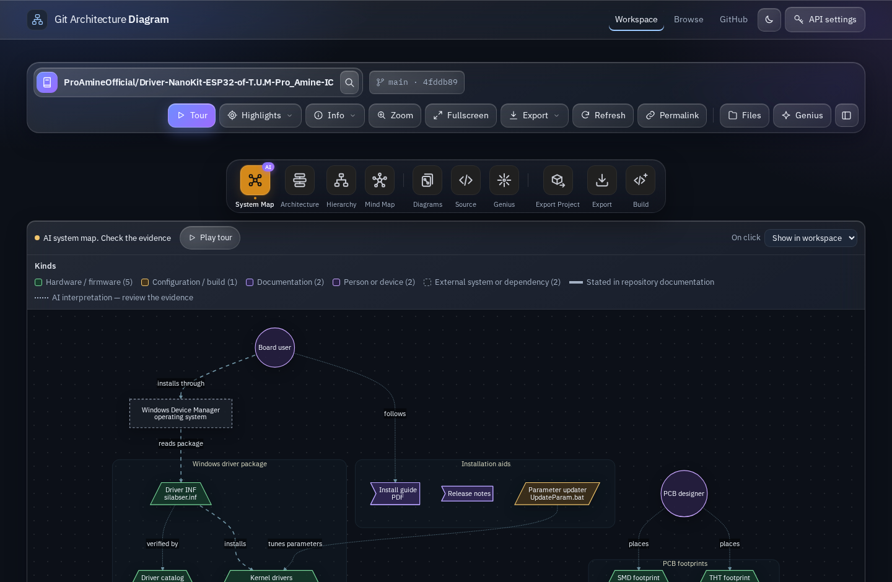
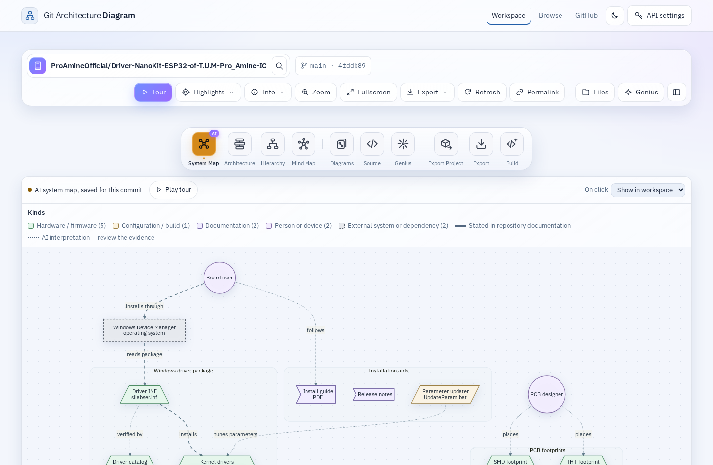
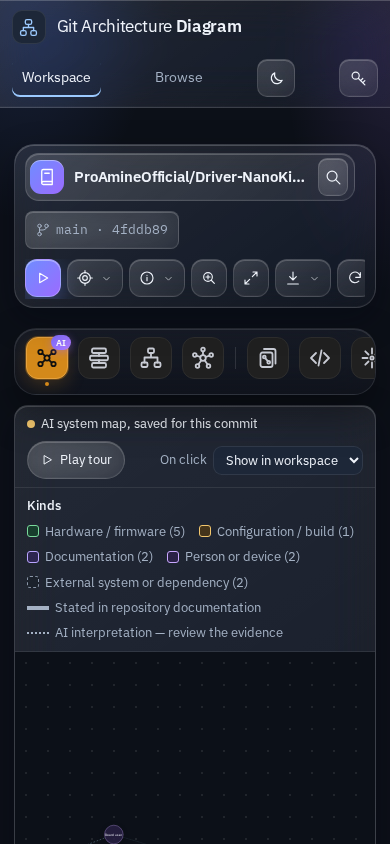
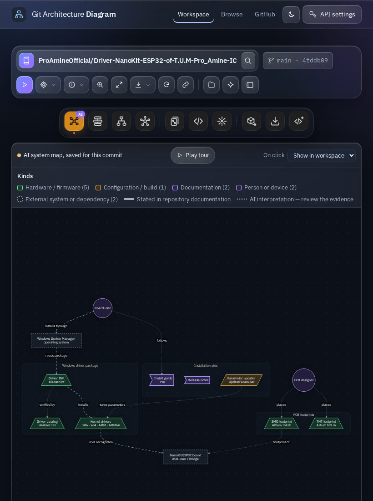
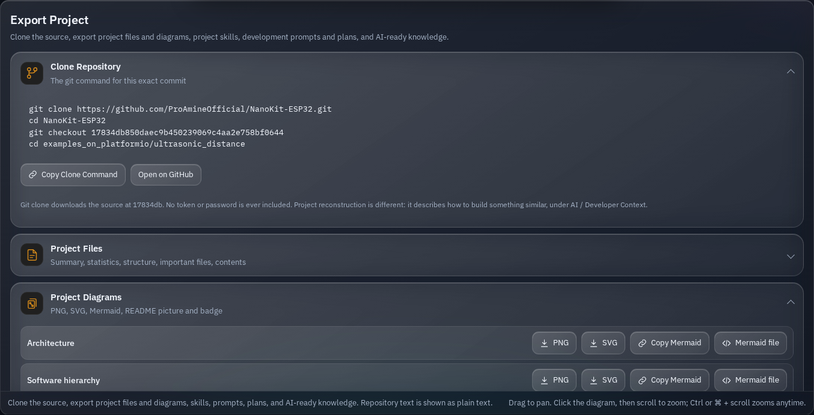
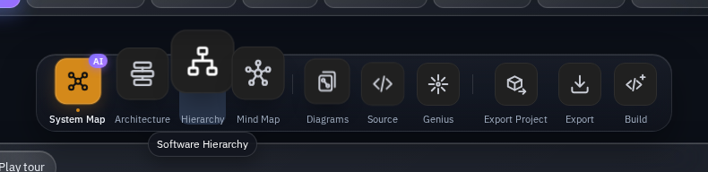
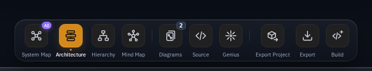
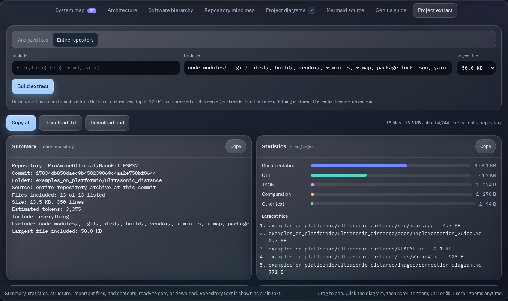

# Git Architecture Diagram

**Understand. Visualize. Highlight. Extract. Build.**

Git Architecture Diagram transforms a GitHub repository into an interactive, diagram-first workspace for architecture understanding, software hierarchy, repository mind maps, source-grounded Genius guidance, project extraction, and developer-ready exports.

Replace the GitHub hostname with your Git Architecture Diagram hostname and open the same repository path as an analysis workspace.

Created by **Amine Saoud ibn al-Bashir** — **ProAmineOfficial / Pro_Amine LLC**.  
Open source under the **MIT License**.

---

## Official workspace

### Dark workspace



### Light workspace



### Mobile workspace



### Tablet workspace



### Export Project



### macOS-style dock interaction



### Dock navigation and project diagram count



### Project Files extract



---

## Open any repository by replacing the hostname

Example repository:

```text
https://github.com/ProAmineOfficial/Driver-NanoKit-ESP32-of-T.U.M-Pro_Amine-IC
```

Production-domain form:

```text
https://gitarchitecturediagram.com/ProAmineOfficial/Driver-NanoKit-ESP32-of-T.U.M-Pro_Amine-IC
```

The repository opens in Git Architecture Diagram and starts analysis.

The same idea also applies to repository paths such as:

```text
/owner/repo
/owner/repo/tree/<branch-or-commit>/<folder>
/owner/repo/blob/<ref>/<file>#L12-L20
```

Permalinks can preserve the analyzed commit, selected file, selected lines, and current view.

---

## What you get

| View | Purpose |
|---|---|
| **System Map** | AI-assisted system-level map showing people, devices, outside systems, components, layers, flows, and guided-tour paths |
| **Architecture** | Component-level architecture derived from the analyzed repository scope |
| **Software Hierarchy** | Shows how the software is organized by layers, roles, components, and key files rather than only by folders |
| **Repository Mind Map** | Organizes repository concepts such as architecture, entry points, infrastructure, dependencies, documentation, and tests |
| **Project Diagrams** | Authored and generated diagrams associated with the project |
| **Mermaid Source** | Editable Mermaid representation with syntax checking |
| **Genius Guide** | Structure summary, reading order, stack analysis, documentation checks, coverage, and evidence-grounded guidance |
| **Export Project** | Project-level export workspace for files, diagrams, skills, prompts, plans, and AI/developer context |
| **Files** | Searchable retained repository tree with source navigation |
| **Build With Genius** | Development-oriented outputs for extending, rebuilding, or planning a similar application |

---

## Three navigation layers

Git Architecture Diagram separates global navigation, repository actions, and workspace views.

### 1. Global application header

- Workspace
- Browse
- GitHub
- Theme
- API Settings

### 2. Repository command bar

- repository identity and repository search
- branch and commit
- Tour
- Highlights
- Info
- Zoom
- Fullscreen
- Export
- Refresh
- Permalink
- Files
- Genius
- panel layout toggle

### 3. Centered view dock

- System Map
- Architecture
- Hierarchy
- Mind Map
- Diagrams
- Source
- Genius
- Export Project
- Export
- Build

Every dock item has its own line icon.

The active view uses an amber state with a small indicator dot. On desktop, the dock uses proximity-based magnification: the icon under the pointer grows the most, neighboring icons grow progressively, and icons rise without causing layout reflow.

Touch, narrow-screen, and reduced-motion layouts use a simpler interaction.

---

## Diagram-first workspace

The repository page is centered around one large analysis canvas.

The workspace is designed so that repository context stays visible while the user moves between architecture, hierarchy, source, mind map, Genius, export, and build-oriented views.

The interface supports:

- dark theme
- light theme
- desktop
- tablet
- mobile
- fullscreen
- interactive zoom
- drawer-based Files and Genius panels

---

## Highlights

Highlights can isolate important areas of a repository, including:

- key architecture
- entry points
- core components
- data flow
- API flow
- frontend
- backend
- storage
- external services
- AI components
- hardware
- security-critical parts
- build and deployment
- tests
- documentation
- high-dependency nodes
- Genius highlights
- custom requests such as `authentication flow`

Unrelated nodes can dim while the selected nodes and paths are emphasized.

Highlight results can be labeled as:

- **Source-derived**
- **Genius interpretation**
- **Keyword match**

---

## Software Hierarchy

Software Hierarchy answers:

> How is this software organized?

rather than only:

> Where are the files?

It can expose:

- application layers
- frameworks and SDKs
- services
- APIs
- storage
- drivers
- hardware-facing layers
- tests
- deployment
- key files
- entry points

Possible role badges include:

- `ENTRY POINT`
- `CORE`
- `PUBLIC API`
- `CRITICAL`
- `EXTERNAL`

Embedded repositories can use embedded-specific layer names.

---

## Repository Mind Map

The Repository Mind Map organizes project concepts instead of only folder structure.

It can include:

- architecture
- README features
- entry points
- infrastructure
- dependencies
- documentation
- tests

Selecting a concept can:

- explain it in Genius
- highlight it in the System Map
- highlight it in Architecture
- reveal the related hierarchy branch
- reveal related files

---

## System Map and Guided Tour

The System Map provides a higher-level view of how repository components fit together.

A guided tour can:

- move the camera to the current node
- highlight the edge that led there
- explain the current step
- follow the main flow
- respect reduced-motion settings

System Map output can distinguish repository-backed evidence from model inference.

---

## Genius and verified evidence

Genius is designed to separate verified repository evidence from AI interpretation.

For source-grounded answers, the server can verify:

- repository
- analyzed commit
- file path
- source line
- verbatim quote

against the analyzed GitHub snapshot.

The interface can distinguish:

- **Verified source**
- **Genius inference**

Browser-supplied text alone does not make a citation trusted.

---

## Export

Quick Export is available from both the repository command bar and the dock.

Supported quick outputs can include:

- PNG
- SVG
- Copy Mermaid
- Download Mermaid
- README Picture
- README Badge

Both Export entry points use the same export system.

---

## Export Project

**Export Project** is the project-level export workspace.

It groups project knowledge into reusable developer outputs.

### Clone Repository

Generate an exact clone workflow for the analyzed repository and commit.

```bash
git clone https://github.com/owner/repository.git
cd repository
git checkout <commit>
```

Credentials are never included in generated clone commands.

### Project Files

Project Files can provide:

- Summary
- Statistics
- Directory Structure
- Important Files
- File Contents

Actions can include:

- Copy All
- Download `.txt`
- Download `.md`

The extract can work with analyzed files or, within configured limits, the entire repository archive.

### Project Diagrams

Supported diagram exports can include:

- Architecture
- System Map
- Software Hierarchy
- Repository Mind Map
- authored diagrams

Available formats can include:

- PNG
- SVG
- Mermaid
- README Picture
- README Badge

### Project Skills

Project Skills can separate:

- observed skills with evidence
- recommended skills with reasons

Export formats can include:

- Markdown
- text
- JSON

### Genius development outputs

Genius can generate:

- Development Prompt
- Build Similar App
- MVP Plan
- Frontend Plan
- Backend Plan
- API Plan
- Database Plan
- App Blueprint
- Implementation Roadmap

### AI / Developer Context

Reusable project knowledge can include:

- AI-ready Context
- Developer Pack
- Project Knowledge Pack
- Project Reconstruction Pack

Verified source material and Genius inference should remain visibly separate.

---

## Project Files extract

Project Files turns repository context into portable text for AI assistants, documentation, or developer onboarding.

The extract can include:

- repository summary
- language and size statistics
- directory structure
- important files
- relevant file contents
- estimated context size
- estimated token count
- include filters
- exclude filters
- largest-file limit

Credential files such as `.env` and private keys must never be read.

Large repositories are handled under configured archive, unpacked-size, file-size, and retained-text limits.

---

## How files are chosen

The analyzer begins with repository evidence such as:

- README files
- manifests
- declared entry points
- local imports/includes

It then follows references into related files.

Examples and tests can be deprioritized when stronger core application files are available.

Analyzed files can record why they were selected.

---

## Run locally

Requires **Node.js 22.12 or newer**.

```bash
git clone https://github.com/ProAmineOfficial/GitArchitectureDiagram.git
cd GitArchitectureDiagram
npm ci
npm start
```

Then open a repository path such as:

```text
http://localhost:3000/ProAmineOfficial/Driver-NanoKit-ESP32-of-T.U.M-Pro_Amine-IC
```

Public repositories can be analyzed without an AI provider key.

---

## Optional AI providers

The workspace can support providers configured by the user or operator, including:

- OpenAI
- Claude
- Gemini
- Kimi

The interface can show provider, model, request size, and output limits before an external AI request is sent.

Never commit `.env` or provider credentials.

---

## Generate documentation from the terminal

```bash
npm run analyze -- ProAmineOfficial/Driver-NanoKit-ESP32-of-T.U.M-Pro_Amine-IC   --max-files 24   --output .genius
```

A specific ref can be supplied when a reproducible snapshot is required.

---

## Develop and test

```bash
npm run dev
npm run check
npm test
npm run test:browser
npm run build
```

The project includes:

- automated Node tests
- browser checks with Playwright
- GitHub API emulation for deterministic ingestion tests
- browser and Workers-compatible build output

---

## Scope and safety

Repository analysis is intentionally bounded.

Typical safeguards include limits for:

- file count
- per-file size
- retained text
- tree size
- archive size
- unpacked repository size

Generated/vendor folders, likely credential files, symlinks, and binaries can be skipped while still remaining visible in repository structure where useful.

Large monorepos work best when analyzed folder by folder.

No analyzed repository code is executed, built, or installed as part of repository analysis.

---

## Project vision

Git Architecture Diagram is built to make complex repositories easier to understand, explore, document, export, and extend.

The platform brings together:

- architecture visualization
- system maps
- software hierarchy
- repository mind maps
- source-grounded Genius guidance
- project extraction
- developer-ready exports
- AI-assisted development preparation

The goal is simple:

**Understand. Visualize. Highlight. Extract. Build.**

---

## Built with

- Node.js
- Mermaid
- DOMPurify
- marked
- fflate
- IBM Plex

Third-party licenses remain with their respective authors.

---

## License

MIT License.

---

## Credits

Built by **Amine Saoud ibn al-Bashir**  
**ProAmineOfficial / Pro_Amine LLC**
