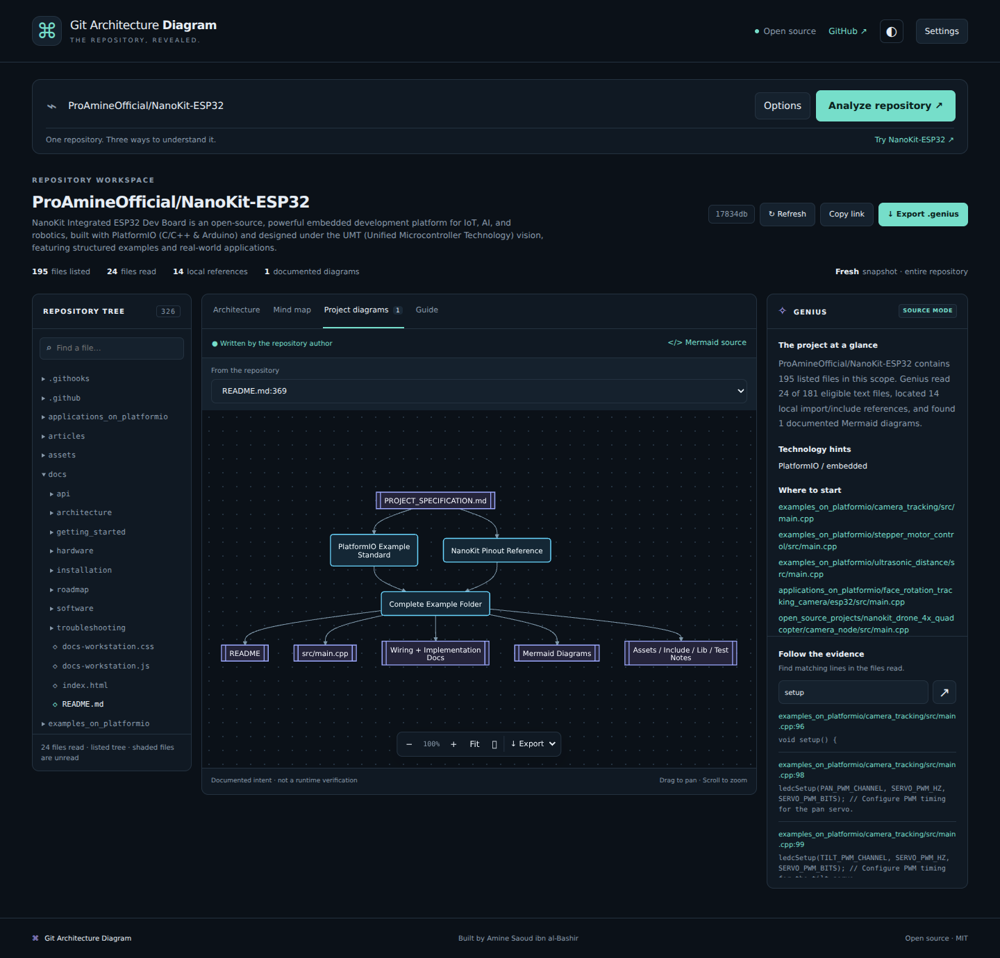

# Git Architecture Diagram

**Understand the repository. Follow the evidence. Keep the documentation.**

Git Architecture Diagram turns a GitHub repository into an interactive **Mermaid architecture diagram**, a **repository mind map**, a searchable **Repository Tree**, and a reproducible **Genius guide**.

Created by **Amine Saoud ibn al-Bashir — [ProAmineOfficial](https://github.com/ProAmineOfficial)**. Open source under the MIT license.

[العربية](README.ar.md) · [Architecture](docs/ARCHITECTURE.md) · [Deployment](docs/DEPLOYMENT.md) · [Privacy and analysis limits](docs/PRIVACY.md) · [Contributing](CONTRIBUTING.md)



## Run it

Requires **Node.js 22.12 or newer** and npm.

```bash
git clone https://github.com/ProAmineOfficial/GitArchitectureDiagram.git
cd GitArchitectureDiagram
npm ci
npm start
```

Open **http://localhost:3000**. Paste a GitHub URL or `owner/repository`, then select **Analyze repository**. Public repositories work without an AI key. GitHub's unauthenticated API allowance is limited; an optional GitHub read token increases the available allowance.

Try `ProAmineOfficial/NanoKit-ESP32`. For a detailed hardware example, set **Folder scope** to `examples_on_platformio/ultrasonic_distance`.

## What works today

| Capability | Behavior |
| --- | --- |
| Repository input | GitHub URL, `owner/repo`, `/tree/ref/folder`, or `/blob/ref/file`; explicit branch, tag, commit, and folder options |
| Repository Tree | Searchable, expandable inventory; listed files are distinguished from files actually read |
| Mermaid architecture | Source-located local imports/includes; directory groups; an 18-file preview with disclosed omissions |
| Mind map | A hierarchy derived from the observed tree, with explicit preview limits |
| Project diagrams | Existing Mermaid blocks from sampled Markdown, with their source path and line; useful for documented workflows and wiring |
| Genius source mode | Coverage, stack hints, entrypoint candidates, documentation presence, dependency evidence, and a reproducible guide |
| Genius AI | Optional OpenAI interpretation of disclosed source excerpts, with validated path/line references and separately labeled inference |
| Source inspector | Verified file bytes, line numbers, and links pinned to the analyzed commit |
| Evidence search | Keyword matches in the files actually read; works without a model |
| Diagram controls | Pan, zoom, fit, fullscreen, editable Mermaid preview, dark/light themes, responsive layout |
| Exports | Mermaid, SVG, PNG, and a ZIP containing `.genius/README.md`, diagrams, tree, and evidence JSON |
| Refresh and sharing | Explicit reanalysis and share links pinned to a commit; shared links never contain credentials |
| CLI | Generate actual `.genius` documentation from the same analysis engine |

The interface renders real API results. It does not include preloaded sample analysis disguised as a completed run.

## Replace the GitHub domain

The application already supports this route shape:

```text
https://github.com/OWNER/REPOSITORY
                   ↓ replace the host after deployment
https://YOUR-DEPLOYED-HOST/OWNER/REPOSITORY
```

The same works for GitHub `tree` and `blob` paths. The host above is a placeholder, **not a provisioned public service**. Deploy this Node application and configure your domain first. Creating the GitHub repository alone does not host the analyzer. GitHub Pages cannot run this backend. See [deployment instructions](docs/DEPLOYMENT.md).

## Genius: evidence first, optional AI

The default analysis uses GitHub metadata and source text. It does **not** require a model. It can identify structure, imports/includes, manifests, author-written diagrams, and documentation presence. It does not claim to understand every runtime behavior from filenames.

For deeper explanation, open **Settings**, supply an OpenAI API key and an explicit model ID supporting the Responses API's structured output, then enable **Add Genius AI interpretation** under Options. Only this opt-in path calls the model. Provider charges may apply. A failed AI request leaves the structural report available.

For a protected hosted instance, copy `.env.example` to `.env` and configure:

```dotenv
OPENAI_API_KEY=your-key
GENIUS_MODEL=your-explicit-model-id
GENIUS_ACCESS_TOKEN=your-instance-access-password
```

Enter the instance password in Settings. A server-wide AI key is **not used by anonymous web requests**. The local CLI can use environment credentials directly. Do not commit `.env` or any real keys.

## Generate documentation from the terminal

```bash
npm run analyze -- ProAmineOfficial/NanoKit-ESP32 \
  --scope examples_on_platformio/ultrasonic_distance \
  --max-files 24 \
  --output .genius
```

Add `--ref COMMIT_SHA` to reproduce an exact snapshot. Add `--ai` only when you want model interpretation and have configured `OPENAI_API_KEY` and `GENIUS_MODEL`. `GITHUB_TOKEN` may be used for repositories your local CLI is authorized to read.

Generated guides identify the generator version, timestamp, commit, input blobs, coverage, skipped reads, and validation limits. Exporting does not write back to the analyzed repository.

## Scope and limits

- Any accessible GitHub repository can be **listed within API and size limits**. Depth of understanding depends on readable source and language support.
- Local dependency extraction supports common **JavaScript/TypeScript, Python, and C/C++** import/include forms. Other languages still receive the tree, eligible text inspection, diagrams from documentation, and optional AI interpretation.
- Extraction is lexical and best-effort: no compiler, runtime call graph, build execution, dependency installation, hardware validation, or security certification of the analyzed project.
- Default budget: 32 files; configurable from 1 to 120. Limits: 96 KB per file, 900 KB total source, and 12,000 retained tree entries. Generated/vendor folders, likely credential filenames, symlinks, binary data, and oversized files are skipped. Filename filtering is not a secret scanner.
- AI context is capped at 6,500 characters per file and 110,000 source characters total. Path/line validation checks reference existence, **not the truth of every model interpretation**.
- Large monorepos work best with a folder scope. The graph, mind map, and source inspector are bounded previews; evidence exports disclose their coverage.
- Private repositories need a caller-supplied read token. Public reports have a bounded in-memory cache; private reports do not enter it. See the [data handling details](docs/PRIVACY.md).
- There are no automatic webhooks, commit diffs, video generation, GitHub Enterprise support, or AST-level multi-language analyzers in v0.1.0.

## Develop and test

```bash
npm run dev
npm run check
npm test
```

Tests cover immutable GitHub ingestion, branch resolution, private-token isolation, source evidence, partial coverage, cache behavior, the mocked OpenAI contract, HTTP routing, origin checks, and static path containment. No real model credentials are needed to run them.

## Why this project

[GitDiagram](https://github.com/ahmedkhaleel2004/gitdiagram) demonstrates how useful a repository diagram can be. [NanoKit-ESP32](https://github.com/ProAmineOfficial/NanoKit-ESP32) demonstrates the value of organized Mermaid documentation, repository structure, and reproducible guides. This independent implementation brings those workflows together around source evidence and portable documentation. It does not claim affiliation with GitDiagram or copy its code.

Built with Node.js, Mermaid, DOMPurify, marked, and fflate. Their licenses remain their respective authors' licenses.
