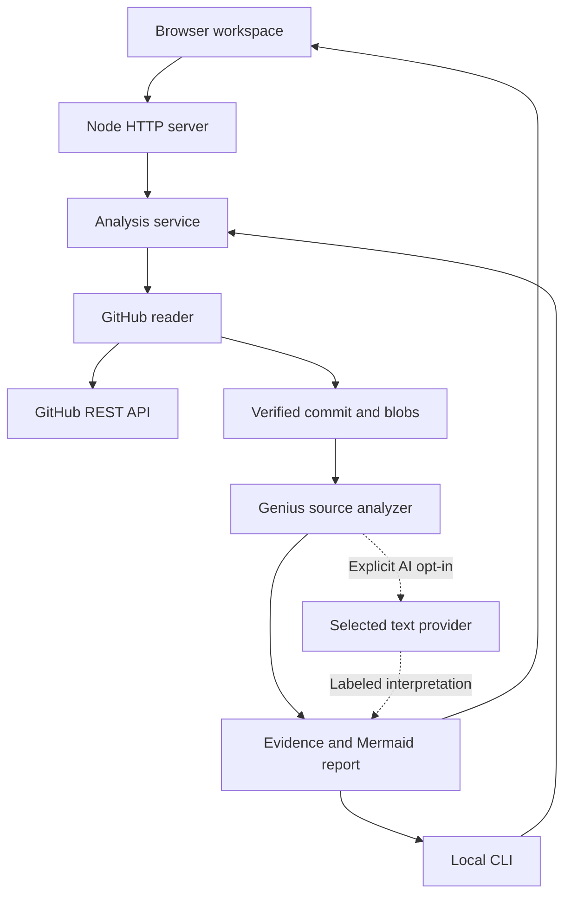

# Application architecture

The browser, HTTP API, and CLI share one source of analysis truth. Repository code is read as data and is never executed.

| Module | Responsibility |
| --- | --- |
| `src/github.mjs` | Validate fixed-host repository inputs; resolve refs; read immutable trees and blobs; verify Git SHA-1 object identities; enforce file and byte budgets |
| `src/genius.mjs` | Resolve common local dependencies; preserve source locations; build Mermaid and documentation; search sampled evidence |
| `src/ai.mjs` | Build bounded excerpts and request optional architecture interpretation through a selected provider |
| `src/graph.mjs` | Validate grouped graph nodes, exact evidence quotes and verified paths; compile safe Mermaid |
| `src/question.mjs` | Recheck source access and answer one explicitly paid question using independently verified citations |
| `public/route-state.js` | Separate the selected branch, pinned commit, folder scope, view, file selection, and line anchors |
| `src/service.mjs` | Orchestrate the pipeline; isolate credentials; cache public commit snapshots; retain short-lived analysis sessions |
| `worker.mjs` | Hosted Fetch API adapter, asset routing, bounded streamed analysis, and no retained report sessions |
| `src/evidence.mjs` | Shared keyword evidence search; the browser searches its existing report locally |
| `scripts/build.mjs` | Bundle the browser and a Workers-compatible ESM server with local assets |
| `server.mjs` | Stream NDJSON progress; serve allowlisted local modules; apply origin, input size, concurrency, and access checks |
| `cli.mjs` | Write actual `.genius` artifacts from the same service |
| `public/app.js` | Display coverage, trees, reports, source inspection, and evidence search |
| `public/diagram.js` | Render sanitized Mermaid; manage pan/zoom and mapped node selection |
| `public/exports.js` | Produce local Mermaid, SVG, PNG, and ZIP downloads |

## Analysis contract

1. Resolve metadata, visibility, a ref, and a scope to a specific commit.
2. Read that commit's recursive tree. Disclose truncation and retained-entry limits.
3. Score eligible text files using README, entrypoint, manifest, and architecture-document hints, with a directory-diversity penalty.
4. Fetch selected immutable Git blobs and verify their object identities. Preserve failures and skipped reads in coverage.
5. Extract lexical references in supported languages. Match them to real listed paths. Keep external or ambiguous imports unresolved.
6. Produce Mermaid, source citations, documentation-presence checks, and the guide. Invisible Mermaid links arrange disconnected components only; they do not represent code relationships.
7. If explicitly requested, send bounded excerpts to the selected provider. Keep this interpretation separate from extracted facts; discard invalid file/line references.
8. Return progress and the result. Exporting does not modify any remote repository.

The default component overview groups the actual inventory into at most 14 nodes and summarizes observed cross-group references. It does not invent relationships for disconnected groups. The file-reference view contains at most 18 file nodes. AI graphs retain up to 96 nodes and 192 relationships, with a 24-node preview and explicit omitted/unmapped counts. Mind maps contain at most 14 groups and 5 named files per group. The source inspector shows a bounded 240-line window around a selected line, or the first 240 lines when no valid line is selected. These display limits do not redefine analysis coverage.

## HTTP API

`POST /api/analyze` accepts JSON: `repository`, optional `ref`, `scope`, `maxFiles`, `githubToken`, `refresh`, `ai`, `apiKey`, `provider`, and `model`. An optional deployment password belongs in the `X-Instance-Token` header. The response is `application/x-ndjson`, with `progress`, `result`, and `error` events. Errors after streaming starts remain HTTP 200 but carry an error event and status; clients must read the full stream.

The browser searches evidence locally, so hosted requests do not depend on server affinity. `POST /api/ask` with `ai: true` accepts `repository`, immutable `commit`, `scope`, `question`, up to eight `evidencePaths`, and optional provider/caller credentials. It sends `progress`, `answer`, or `error` NDJSON events. The `answer` contains source-linked findings, limitations, suggestions, and disclosed source coverage. No answer session is retained. Without explicit AI consent, the hosted question service rejects the request before outbound work. The local server additionally preserves the legacy `id`/`question` evidence-search contract.

`POST /api/source` accepts `repository`, immutable `commit`, `path`, and an optional caller GitHub token. Each call freshly checks metadata/access, tree membership, file eligibility, and the blob hash before returning bounded JSON. Reading an unread file does not silently increase the original analysis coverage.

`GET /api/health` returns availability information without keys. Static application and local vendor modules are served from fixed roots only.

The server permits up to 3 concurrent analyses and 20 API requests per direct client address per minute. The direct-IP limiter is deliberately simple; production hosts should also apply their own gateway limits.

## Hosted runtime

The production Worker uses the same GitHub/Genius engine. It accepts up to 40 files and 48 GitHub requests per run, two active analyses per isolate, and 20 API requests per observed client address per minute. Results are streamed to the browser. Only anonymous public structural reports use a ten-minute, twelve-entry isolate cache keyed by analyzer version, commit, scope, and file budget. Credential-specific and private results, paid responses, and hosted sessions are not retained in that shared cache. Source reads have a 45-second deadline; question provider calls have a 60-second deadline. Gateway protections remain the hosting operator's responsibility.

Build with `npm run build`. The output is `dist/client` plus `dist/server/index.js`, whose default export has a callable `fetch(request, env, ctx)` handler. `dist/server/wrangler.json` declares the assets binding and Node compatibility.
