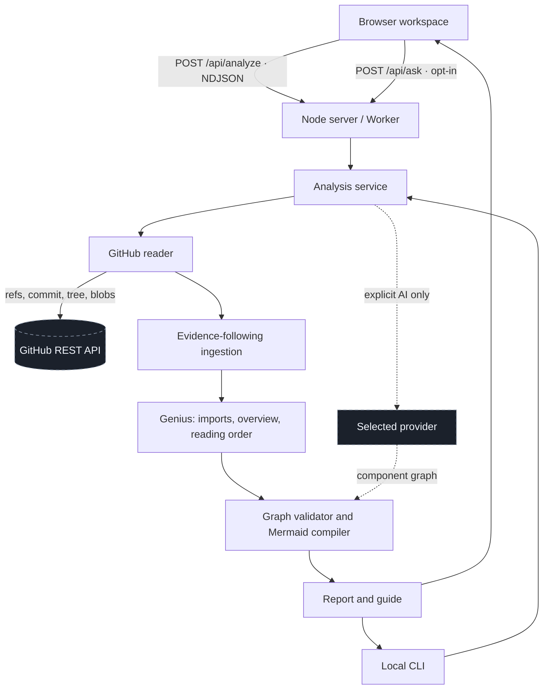

# Application architecture

The browser, the HTTP API (Node server or hosted Worker), and the CLI share one analysis engine. Repository content is read as data and never executed.

| Module | Responsibility |
| --- | --- |
| `src/github.mjs` | Validate inputs; resolve tree/blob refs through `git/matching-refs` (slash branches, tags, SHAs); pin one commit; read the tree and SHA-verified blobs; rate-limit, permission, HTML, and transient-failure handling; evidence-following ingestion |
| `src/overview.mjs` | Reference discovery (imports, manifest entry points), component overview, reading order |
| `src/graph.mjs` | Validate a structured graph against the commit's paths and excerpt lines; compile it to Mermaid with one shape and color per kind and one line style per evidence basis |
| `src/genius.mjs` | Lexical import/include extraction, file-level graph, mind map, authored-diagram discovery (`.md`, `.mmd`), guide |
| `src/ai.mjs` | Bounded excerpts, the architecture interpretation schema, reference and graph validation |
| `src/ask.mjs` | Grounded single-question answers from client-supplied excerpts, with citation validation |
| `src/providers.mjs` | Fixed-endpoint adapters for OpenAI Responses, Claude Messages, Gemini generateContent, and Kimi Chat Completions |
| `src/service.mjs` | Orchestration, credential isolation, public cache (Node only), sessions (Node only) |
| `server.mjs` / `worker.mjs` | HTTP routing, origin/access/rate checks, NDJSON streaming, SPA fallback for every `/owner/repo/...` path |
| `public/route.js` | Pure mapping between GitHub-shaped paths and analysis requests; permalinks |
| `public/app.js` | Workspace state, history, views, tree, inspector, Genius panel |
| `public/diagram.js` | Mermaid rendering (strict security, sanitized SVG), pan/zoom, syntax checks, light-theme tints for generated diagrams |
| `public/ask.js`, `public/browse.js`, `public/exports.js` | Questions, the example catalog, and local downloads |
| `tests/support/github-emulator.mjs` | Test transport that serves real Git repositories through the GitHub REST routes above |

## Analysis contract

1. Parse the address. For tree/blob URLs, list matching branch and tag names and choose the longest that prefixes the path; a hexadecimal first segment is tried as a commit. The remainder is the folder or file.
2. Resolve one commit and read its recursive tree. A blob URL analyzes the file's nearest folder containing a project manifest, with the file read first.
3. Rank candidate files by path hints (scope README and manifests first; examples and tests demoted when core code exists). Read files one at a time; after each read, raise the priority of files it imports and entry points it declares. Record why each file was read.
4. Verify every blob against its Git SHA. Report skipped and unread files.
5. Extract located imports/includes; build the component overview, per-component file graphs, the mind map, the reading order, and the guide. Invisible Mermaid links only arrange unconnected nodes and are marked as such in the source.
6. Only on request, send bounded excerpts to the chosen provider. Validate its graph against the commit before compiling Mermaid; keep interpretation separate from extracted facts.

## HTTP API

`POST /api/analyze` — JSON `repository`, optional `ref`, `scope`, `maxFiles`, `githubToken`, `refresh`, `ai`, `provider`, `apiKey`, `model`. Returns `application/x-ndjson` with `progress`, `result`, and `error` events. After streaming starts, errors arrive as an `error` event with HTTP 200; clients must read to the end. The browser checks the content type before parsing and names HTML gateway pages as such.

`POST /api/ask` — JSON `ai: true`, `question` (≤600 characters), `excerpts` (≤12, each `path`, `startLine`, `text` ≤4,000 characters, ≤32,000 total), `repository`, `commit`, `provider`, `apiKey`, `model`. Returns `answer`, `findings` (each with `path` and `line` inside a sent excerpt), `suggestions`, `answered`, `discardedCitations`, `usage`. Requests without `ai: true` get evidence search on the Node server (session-based) and HTTP 400 on the Worker, where keyword search runs in the browser.

`GET /api/health` — version, runtime limits, whether a server AI key is usable, whether an access password is required.

Both runtimes allow 20 API requests per client address per minute; the Node server runs up to 3 analyses at once, the Worker 2 per isolate with 48 GitHub requests per run. Request bodies are capped at 20 KB (64 KB for `/api/ask`).

## Hosted build

`npm run build` writes `dist/client` (bundled browser code, styles, fonts) and `dist/server/index.js` with `wrangler.json` declaring the assets binding and Node compatibility.
