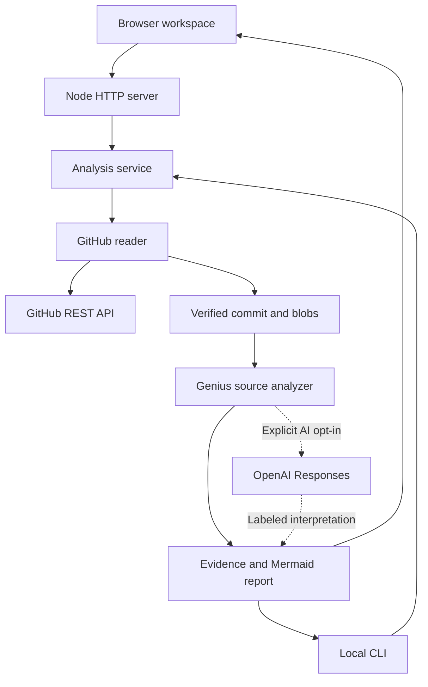

# Application architecture

The browser, HTTP API, and CLI share one source of analysis truth. Repository code is read as data and is never executed.

| Module | Responsibility |
| --- | --- |
| `src/github.mjs` | Validate fixed-host repository inputs; resolve refs; read immutable trees and blobs; verify Git SHA-1 object identities; enforce file and byte budgets |
| `src/genius.mjs` | Resolve common local dependencies; preserve source locations; build Mermaid and documentation; search sampled evidence |
| `src/ai.mjs` | Build bounded, line-numbered excerpts; call the Responses API only on request; validate model path/line references |
| `src/service.mjs` | Orchestrate the pipeline; isolate credentials; cache public commit snapshots; retain short-lived analysis sessions |
| `server.mjs` | Stream NDJSON progress; serve allowlisted local modules; apply origin, input size, concurrency, and access checks |
| `cli.mjs` | Write actual `.genius` artifacts from the same service |
| `public/app.js` | Display coverage, trees, reports, source inspection, and evidence search |
| `public/diagram.js` | Render sanitized Mermaid; manage pan/zoom and mapped node selection |
| `public/exports.js` | Produce local Mermaid, SVG, PNG, and ZIP downloads |

## Analysis contract

1. Resolve metadata, visibility, a ref, and a scope to a specific commit.
2. Read that commit's recursive tree. Disclose truncation and retained-entry limits.
3. Score eligible text files using README, entrypoint, manifest, and architecture-document hints, with a directory-diversity penalty.
4. Fetch selected immutable Git blobs and verify their object identities. Preserve failures and skipped reads in coverage.
5. Extract lexical references in supported languages. Match them to real listed paths. Keep external or ambiguous imports unresolved.
6. Produce Mermaid, source citations, documentation-presence checks, and the guide. Invisible Mermaid links arrange disconnected components only; they do not represent code relationships.
7. If explicitly requested, send bounded excerpts to OpenAI. Keep this interpretation separate from extracted facts; discard invalid file/line references.
8. Return progress and the result. Exporting does not modify any remote repository.

Architecture previews contain at most 18 file nodes. Mind maps contain at most 14 groups and 5 named files per group, with omitted counts. The source inspector shows the first 240 lines. These display limits do not redefine analysis coverage.

## HTTP API

`POST /api/analyze` accepts JSON: `repository`, optional `ref`, `scope`, `maxFiles`, `githubToken`, `refresh`, `ai`, `apiKey`, and `model`. An optional deployment password belongs in the `X-Instance-Token` header. The response is `application/x-ndjson`, with `progress`, `result`, and `error` events. Errors after streaming starts remain HTTP 200 but carry an error event and status; clients must read the full stream.

`POST /api/ask` accepts `id` and `question`. This endpoint returns **evidence-search results**, not a model-generated answer. Session IDs expire and are bearer capabilities; they must not be shared for private analyses.

`GET /api/health` returns availability information without keys. Static application and local vendor modules are served from fixed roots only.

The server permits up to 3 concurrent analyses and 20 API requests per direct client address per minute. The direct-IP limiter is deliberately simple; production hosts should also apply their own gateway limits.
